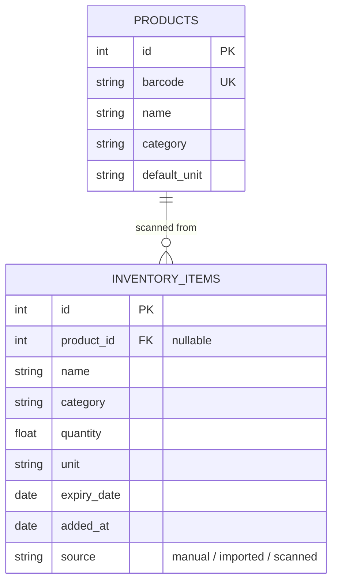

# Data model

Reflects the schema as it actually exists in `backend/app/models.py` right
now — update this diagram in the same PR as any migration that changes it.
For the reasoning behind a given shape, see `docs/decisions/`.

