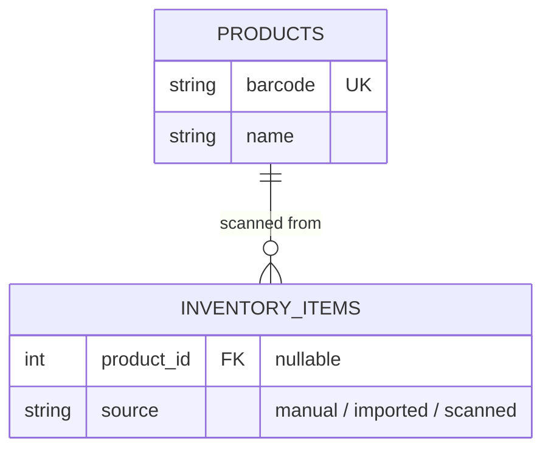

# 3. Barcode scan data model

Date: 2026-07-20
Status: proposed

## Context

Barcode scanning is the next feature after input validation. Two things
need deciding before touching the schema, because getting them wrong means
a painful migration once receipt import (also planned) needs the same
groundwork: how a scanned barcode turns into product data, and how that
data relates to the existing flat `inventory_items` table
(`backend/app/models.py`).

For the prototype, scanning happens via a USB webcam plugged into the Pi
(no USB barcode scanner on hand yet) — but the input mechanism shouldn't
leak into the data model or the rest of the flow.

## Decision

**Camera now, swappable later.** A JS decoding library reads the webcam
stream in the frontend and resolves to a barcode string, fed into a
single handler (`onBarcodeDetected(code: string)`). A USB scanner acts as
a keyboard (types the code + Enter into whatever has focus), so adding
one later means wiring a keystroke listener into the same handler — not a
redesign.

**`@zxing/browser`, despite being in maintenance mode.** The underlying
`@zxing/library` gets bug fixes only, no active feature development, and
the project is looking for new maintainers — a real but modest risk for a
local library that only decodes camera frames (no network/third-party
data through it). The browser-native `BarcodeDetector` API was
considered instead (no npm dependency at all), but its detection backend
only exists on macOS, ChromeOS, and Android — not Linux, ruling it out
for the Pi. The deciding factor for ZXing over e.g. Quagga2 (actively
maintained, but 1D-only): ZXing decodes both 1D (EAN-13/UPC-A, for real
grocery barcodes) and 2D (QR) in one library and one handler — needed to
also support self-printed QR labels for pantry items that don't have a
barcode at all. `barcode` in the `products` table stays a plain string
either way, so this doesn't affect the schema.

**New `products` table, not new columns on `inventory_items`.**
`barcode` (unique, indexed), `name`, optional `category`/`default_unit`.
`inventory_items` gets a nullable `product_id` FK, set only for entries
added via scan — manual entries stay exactly as they are now. Keeping
products separate means one barcode can back many inventory entries
(different expiry dates, restocked over time) without duplicating product
data, and the same table can be reused by receipt import later instead of
inventing a second lookup concept.

**Local cache first, Open Food Facts as fallback.** On an unknown barcode,
query the Open Food Facts API (free, no auth) and cache the result in
`products`; every later scan of the same barcode is fully local. A full
offline product database was rejected — multi-GB, food-only, upkeep for a
single Pi. The API call is not a hard dependency: manual entry stays the
fallback if the lookup fails or the product isn't listed (non-food pantry
items never will be).

**`Source` gets a third value: `scanned`.** Currently `manual` / `imported`
(`backend/app/models.py:10`). A scan is not "manual" (data wasn't typed)
and not "imported" in the receipt-import sense (structured, has no name-
mapping problem) — worth distinguishing in the UI and later in any
per-source stats.

*Only the new/changed columns from this decision — not the full schema.
`INVENTORY_ITEMS` already has `name`, `quantity`, `unit`, etc. (see
`docs/data-model.md` for the current full picture, and
`backend/app/models.py` for the actual definitions).*

## Consequences

- New Alembic migration for `products` + the `product_id` FK and `Source`
  enum value.
- `getUserMedia` (camera access) requires a secure context — fine for the
  kiosk hitting the Pi over `localhost`/its own origin, but would need
  HTTPS if the UI is ever opened from another device on the LAN.
- Cached product data can go stale (name changes, discontinued products)
  — no refresh mechanism yet, would need one if this becomes annoying in
  practice.
- Open Food Facts only covers food/grocery products well; non-food pantry
  items (cleaning supplies, etc.) will always fall back to manual entry.
- External API responses get validated the same way request bodies are
  now (via Pydantic) before anything is written to `products` — not
  trusting a third party's shape by default.
